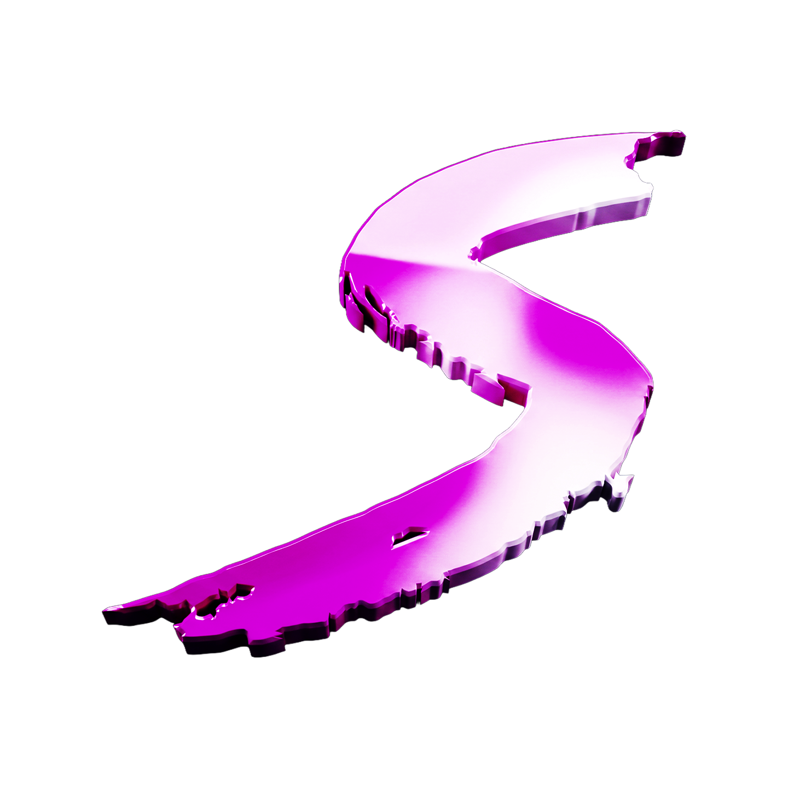

<div align="center">



<br />

<h1>SHAKE V1</h1>
<h3>EXTERNAL MENU</h3>

<p><strong>FiveM external menu — açık kaynak · ücretsiz sürüm</strong></p>

<br />

[]()
[]()
[]()
[]()

<br />


<br /><br />

*Created By Revers · Shake V1 Revers*

</div>

---

## Shake V1 Artık Açık Kaynak

Merhaba,

Shake'in ilk sürümü (V1), geliştirme sürecimde önemli bir yere sahipti. Ancak artık yeni nesil sürümlere odaklandığım için V1'i aktif olarak geliştirmiyorum.

Bu nedenle Shake V1'in kaynak kodunu açık kaynak olarak toplulukla paylaşmaya karar verdim.

**Amacım;**

- Kendi oyun yazılımı projelerini geliştirmek isteyen geliştiricilere bir referans sunmak,
- Öğrenmek ve denemek isteyenlere gerçek bir proje üzerinden çalışma imkânı sağlamak,
- Dileyen herkesin Shake'in ücretsiz sürümünü kullanabilmesini sağlamak.

Depo içerisinde hazır derlenmiş (EXE) sürüm de bulunmaktadır. İsterseniz doğrudan bu sürümü kullanabilir, isterseniz kaynak kodunu kendiniz derleyerek (build ederek) kendi ortamınızda çalıştırabilirsiniz.

Umarım bu proje yeni fikirlerin ortaya çıkmasına, yeni projelerin gelişmesine ve geliştiricilere fayda sağlamasına katkıda bulunur.

Projeyi inceleyen, kullanan, katkıda bulunan ve destek veren herkese şimdiden teşekkür ederim.

> [!IMPORTANT]
> **Anti-cheat bypass:** İçerisinde **Felox AC** ve **Waveshield** silent aim bypass kodu bulunuyor (`GetPedLastWeaponImpactCoord` hook). **1000 FOV** destekli.

Keyifli geliştirmeler.

---

## Hızlı Başlangıç

### Hazır EXE (derleme gerekmez)

1. FiveM'i açın ve sunucuya girin.
2. **`Build/Cheat/Shake_V1_Free.exe`** dosyasını **Yönetici olarak çalıştırın**.
3. Menüyü açmak için varsayılan tuş: **`INSERT`**

### Kaynaktan derleme

| Gereksinim | Sürüm |
|---|---|
| Windows | 10 / 11 (x64) |
| Visual Studio | 2022 |
| Windows SDK | 10.0.26100.0 |
| Platform | **Release x64** |

1. `Shakepriv++.sln` dosyasını Visual Studio ile açın.
2. Yapılandırma: **Release \| x64**
3. **Build → Build Solution**
4. Çıktı: `Build/Cheat/Shake_V1_Free.exe`

---

<div align="center">


## Features


</div>

###  Aim Assist — Silent Aim

- Silent Aim (aç/kapa, tuş ataması)
- Hedef kemik seçimi (Head, Body, Neck, Closest Bone, Global Target ve daha fazlası)
- **FOV ayarı (1 – 1000)**
- Mesafe limiti, miss chance, dynamic FOV
- Draw Silent FOV + renk özelleştirme
- Show Line (hedef çizgisi)
- Magic Bullet
- NPC / ölü hedef filtreleme
- **Felox AC & Waveshield bypass** (`impact_coord_bypass`)

###  Aim Assist — Aimbot

- Aimbot (FOV, smooth, tuş ataması)
- 28 farklı kemik hedefi
- Visible only, ignore death / NPCs / friends
- Draw Aimbot FOV + dynamic FOV
- **Legit / humanized aim** (jitter, lock süresi, kemik değiştirme, cooldown)
- Özelleştirilebilir crosshair (10 tip, boyut, renk)
- Max mesafe ayarı

###  Aim Assist — Triggerbot

- Triggerbot (FOV, gecikme, tuş ataması)
- Kemik seçimi (Head / Body / Neck)
- Visible only, ignore NPCs
- Draw Trigger FOV

###  Visuals — ESP

- **Skeleton ESP** (renk, kalınlık)
- **Head ESP**
- **Box ESP** — 2D / Corner, gradient desteği
- **Line ESP** — Top / Center / Bottom
- **Name, ID, Weapon, Distance ESP**
- Weapon indicator
- **Gender ESP** (erkek/kadın renk ayrımı)
- **Health & Armor bar**
- **Car ESP**
- ESP Preview (menü içi önizleme)
- Ignore death / NPCs, max mesafe
- Direction ESP & Radar ESP *(kod tabanlı)*

###  Visuals — World

- **Waypoint'e teleport**
- **37+ hazır lokasyon** (arama destekli): Legion Square, Maze Bank, Casino, Mount Chiliad, hastaneler, interior noktaları ve daha fazlası
- **Player List** — arama, oyuncuya TP (50m limit), arkadaş ekle/çıkar, outfit kopyala
- Arkadaş listesi overlay
- **Aim Warning** — size nişan alan / bakan oyuncuları gösterir *(kod tabanlı)*
- **Death Skeleton ESP** — ölüm sonrası iskelet efekti *(kod tabanlı)*

###  Visuals — Vehicle

- Canlı **araç listesi** (isim, mesafe, kilit durumu)
- Seçili araca **teleport**, **kilitle / aç**
- **Fix Vehicle** (tuş ataması)
- **Vehicle Speed** ayarı
- Vehicle ESP — mesafe, snapline, marker *(kod tabanlı)*
- Rocket Boost, Vehicle Break, Gravity, Parachute, Steal Car *(kod tabanlı)*

###  Misc

- **Peek Assist** (konum işaretleme, renk ve boyut)
- **Silah modları:** Infinite Ammo, No Recoil, No Spread, No Range, No Reload
- **Safe Damage Boost**
- **Strafe Macro** (W-A-S-D / D-S-A-W pattern, interval ayarı)
- **FOV Changer**
- **Health & Armor Boost** (tuş ataması)
- **Semi God Mode**
- **Invisible**
- **NoClip** *(tuş ile toggle — kod tabanlı)*
- **God Mode** *(tuş ile — kod tabanlı)*
- **Reload Ammo** *(tuş ile — kod tabanlı)*
- **Hit Log** — isabet bildirimi, hasar, kill mesajı
- **Hit / Kill Sound** + efekt seçimi
- **Hit Particles** (renk özelleştirme)

###  Settings & Overlay

- **Stream Proof**
- Watermark & Active Features listesi
- Menü tuşu değiştirme (varsayılan: INSERT)
- Safe Exit
- Pink temalı ImGui menü, animasyonlu arayüz
- Standalone — **auth / cloud / lisans yok**, tamamen offline

---

## Proje Yapısı

```
shake-old-menu-main/
├── assets/shake_logo.png           ← marka logosu
├── Build/Cheat/Shake_V1_Free.exe   ← hazır sürüm
├── Cheat/                          ← ana kaynak kod
│   ├── Source.cpp                  ← giriş noktası
│   ├── Cheat/                      ← oyun mantığı, memory, bypass
│   ├── Gui/                        ← ImGui menü
│   └── Overlay/                    ← overlay & render
├── Libraries/                      ← bağımlılıklar (DirectX, ImGui, vb.)
└── Shakepriv++.sln
```

---

## Uyarı

> [!WARNING]
> Bu proje yalnızca **eğitim ve referans** amaçlı paylaşılmıştır. FiveM ve GTA V kullanım şartlarına aykırı kullanım sunucu banına yol açabilir. Sorumluluk kullanıcıya aittir.

Antivirüs yazılımları external cheat EXE dosyalarında **false positive** verebilir; kaynak kodu inceleyerek kendiniz derleyebilirsiniz.

---

<div align="center">


<br />

**SHAKE V1 · REVERS**

<br />


<br /><br />

*Made with care for the community.*

</div>
